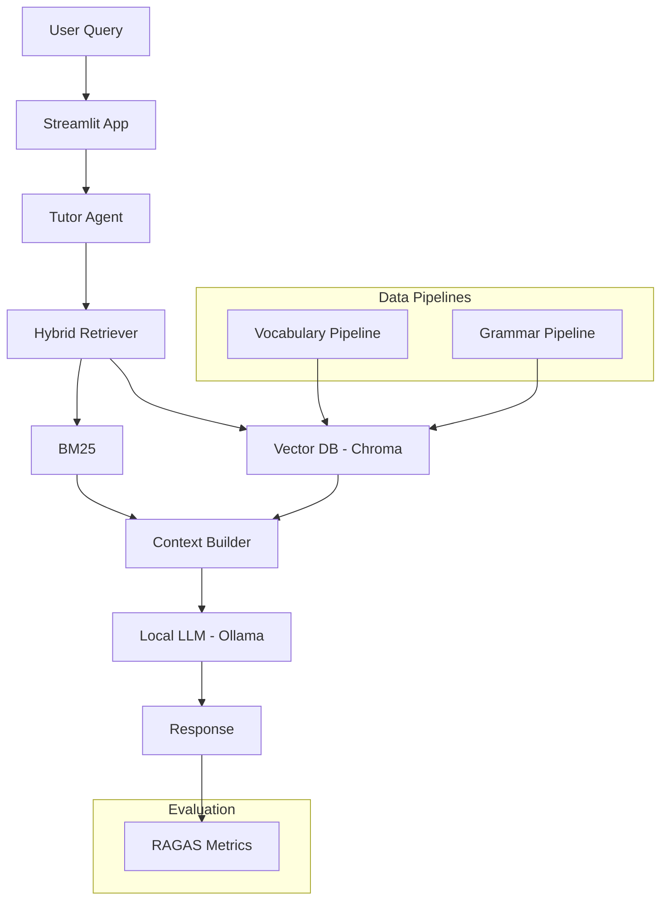

# Project Documentation

This document provides an overview of the system architecture, methodology, and how LangChain is used within the project.

---

## System Architecture

The Tutor LLM Agent follows a **retrieval-augmented generation (RAG)** architecture. Instead of relying solely on a language model, the system retrieves relevant information from structured datasets before generating responses.

This approach improves:

* factual grounding
* consistency of explanations
* controllability of generated outputs

### High-Level Pipeline

```text
User Query
   │
   ▼
Tutor Agent
   │
   ▼
Hybrid Retriever
(BM25 + Vector Search)
   │
   ▼
Context Assembly
   │
   ▼
Local LLM (Ollama)
   │
   ▼
Generated Response
```

The agent orchestrates retrieval and generation to provide context-aware answers.

---

### Mermaid Diagram



## Core Components

### 1. Tutor Agent

The **Tutor Agent** coordinates the workflow between retrieval and generation.

Responsibilities include:

* interpreting the user query
* retrieving relevant information
* assembling structured context
* generating prompts for the LLM

Location in codebase:

```bash
    src/agent/
```

---

### 2. Retrieval System

The project uses a **hybrid retrieval strategy** combining keyword search and vector similarity.

#### BM25 Retrieval

Captures exact keyword matches, which is particularly useful for:

* vocabulary lookups
* grammar terms
* short queries

#### Vector Retrieval

Embeddings allow semantic matching between queries and documents.

Embedding models:

```bash
    sentence-transformers/all-MiniLM-L6-v2
    paraphrase-multilingual-MiniLM-L12-v2
```

Vector database:

```bash
    ChromaDB
```

Location in codebase:

```bash
    src/rag/
```

---

### 3. Context Assembly

Retrieved documents are processed and merged into a structured context before being passed to the LLM.

The goal is to provide the model with:

* vocabulary entries
* grammar explanations
* example sentences

This structured context helps reduce hallucinations and improves explanation quality.

---

### 4. Local LLM Inference

The system runs locally using **Ollama**, allowing inference without external APIs.

Supported models include:

* qwen2.5
* mistral
* llama

Location in codebase:

```bash
    src/llm/
```

Benefits of local inference:

* privacy
* no API cost
* reproducible experiments

---

## LangChain Integration

LangChain is used as the orchestration layer connecting the LLM with the retrieval system.

Main uses of LangChain include:

### LLM Interface

LangChain provides a unified interface to interact with local models through Ollama.

Example configuration:

```python
    from langchain_ollama import ChatOllama

    llm = ChatOllama(
        model="qwen2.5:3b",
        temperature=0
                    )
```

---

### Embedding Generation

Embeddings are generated using LangChain wrappers around SentenceTransformers.

Example:

```python
    from langchain_huggingface import HuggingFaceEmbeddings

    embeddings = HuggingFaceEmbeddings(
        model_name="sentence-transformers/all-MiniLM-L6-v2"
                                        )
```

These embeddings are used to index and retrieve documents from the vector database.

---

### Retrieval Pipeline

LangChain helps manage retrieval and integration with the vector database.

Typical flow:

1. encode query into embedding
2. retrieve similar documents from ChromaDB
3. combine retrieved results with BM25 results
4. assemble context for the LLM

---

## Data Pipelines

The project includes scripts to generate structured datasets used by the tutor.

Location:

```bash
    pipelines/
```

Examples:

Vocabulary dataset generation:

```bash
    v01_topics_vocab.py
    v02_enrich_vocab.py
    v03_clean_vocab_examples.py
```

Grammar lesson generation:

```bash
    g01_grammar_lessons.py
    g02_enrich_grammar_lessons.py
```

These pipelines create datasets stored in:

```bash
    data/
```

---

## Evaluation Framework

The system includes an evaluation pipeline to measure response quality.

Location:

```bash
    eval/
```

Evaluation is performed using **RAGAS**, which measures the quality of retrieval-augmented systems.

Metrics include:

* Answer Relevancy
* Faithfulness
* Context Precision

Evaluation workflow:

1. generate answers for evaluation questions
2. compare generated answers with reference answers
3. compute evaluation metrics

This framework allows benchmarking changes to the retrieval pipeline or prompt structure.

---

## Codebase Structure

```bash
    app/
        Streamlit interface
        learning modes

    src/
        core system components
        agent, rag, llm, embeddings, utils

    pipelines/
        dataset generation scripts

    data/
        structured datasets

    eval/
        evaluation scripts
```

This modular structure separates:

* application logic
* retrieval and model components
* data generation
* evaluation workflows

---

## Methodology

The development of the Tutor LLM Agent followed these steps:

1. Collect German learning data from transcripts and curated vocabulary datasets
2. Generate structured grammar lessons using LLM-assisted pipelines
3. Build a hybrid retrieval system combining BM25 and vector embeddings
4. Integrate a local LLM to generate explanations
5. Evaluate the system using RAGAS metrics

This methodology ensures the system remains modular and reproducible.

---

## Future Improvements

Potential improvements include:

* retrieval reranking models
* lesson progression systems
* spaced repetition vocabulary training
* improved UI interaction
* multi-source retrieval across larger corpora
